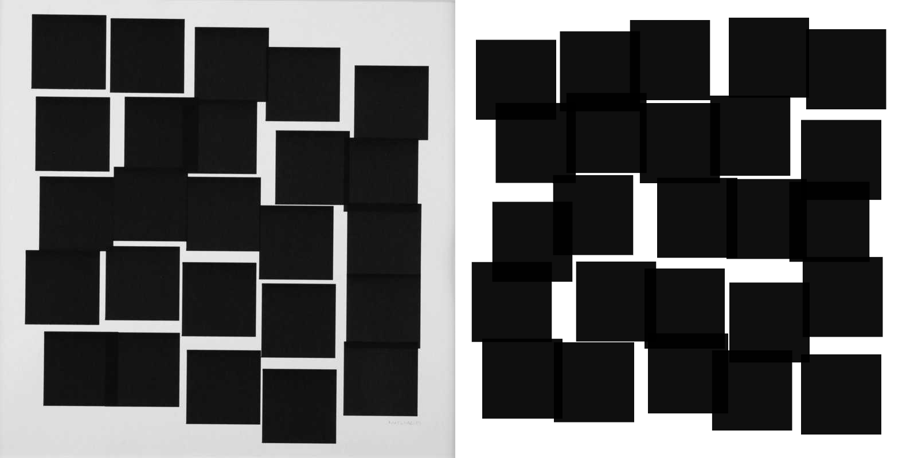
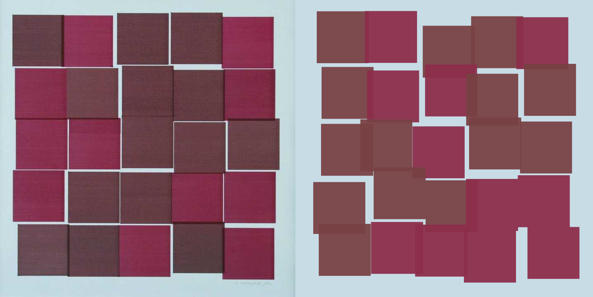
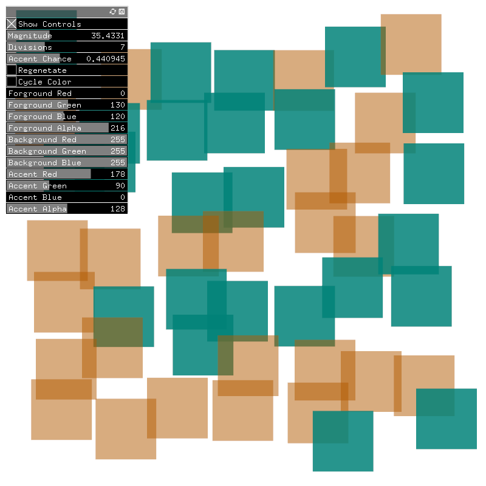

# Recreating the Past

My projects while taking [Recreating the Past](https://sfpc.io/recreatingthepast-spring2020/) with [Zach Lieberman](http://zach.li/) at the [School for Poetic Computation](https://sfpc.io/) in 2020.

## Week 1 - Vera Molnár

### 25 Carrés

## Week 2 - John Whitney

### 1961

<iframe title="vimeo-player" src="https://player.vimeo.com/video/427926125" width="640" height="360" frameborder="0" allowfullscreen></iframe>
