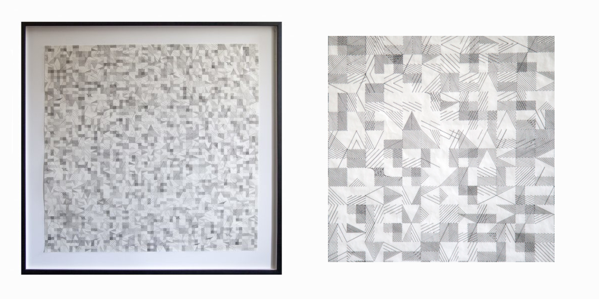

# A la Recherche de Paul Klee

A work originally created by Vera Molnár. Recreated in [openFrameworks]() by Violet Graham.

## Understanding the Original

When I first looked at the original work I immediately noticed the appearance of a grid. The grid however is populated by these groups of lines that are 1 by 2, 2 by 1, or 2 by 2. It took me a while of working on recreating it to realize that my initial thoughts weren't an ideal way of conceptualizing the project. After getting aquatinted with it here's the way I'm thinking of it. I'm mostly writing it to know how I go about my second attempt in recreation.

The work consists of two layers of cells. These cells have 3 main states.There's full, horizontal, and vertical. This cell can be viewed as having a 2 by 2 workspace.

For simplicity in coding we can think of each cell as having 2 arrays of designs. However in the full state only the first one is used. By using arrays it will be easier to recreate designs that are obiously combinations of two designs because of thicker middle lines.

These designs can be made into small functions and translate and rotation is handled by the cell before calling these design functions. All that is passed is a width and height and the design function is assumed to draw within these bounds with the the bounds being centered around the (0, 0). See figure below.

## Running Project

Started with [ofLinuxVSCodeTemplate](https://github.com/violetcraze/ofLinuxVSCodeTemplate)

Project is designed to be used on Linux with vscode. Use the openFrameworks project generator to update for other systems.

### Setup

0. Install clang-format (if not installed already)
1. Open in vscode
2. Click button `Open Workspace`
3. Run command `Extensions: Configure Recommended Extensions (Workspace Folder)` (you can bring up command pallet by using `ctrl + shift + p` and type it in)
4. Start using!

### Tasks

- build (builds project using make)
- run (runs compiled project)
- kill (will kill program if it's running)

`ctrl + shift + b` will run kill, build, and run (this happens by default on save)

Read more about tasks on [vscode website](https://code.visualstudio.com/docs/editor/tasks).
